```markdown
# 🎓 Certificate Maker

A Rust-based certificate generation tool that creates personalized certificates
by overlaying names from CSV files onto PNG templates with customizable fonts, colors, and positioning.

## ✨ Features

- **📊 PNG Analysis**: Analyze image properties, dimensions, and technical details
- **✏️ Interactive Text Overlay**: Add custom text to images with font and color selection
- **🎯 Batch Certificate Generation**: Generate hundreds of certificates from CSV name lists
- **🗂️ Menu-Driven Interface**: No manual path typing - select files from organized directories
- **🎨 Font Management**: Choose from fonts in your assets directory
- **🔍 Debug Tools**: Troubleshoot CSV files, templates, and fonts
- **📁 Smart File Organization**: Automatic directory structure for easy management

## 🚀 Quick Start

### Prerequisites

- [Rust](https://rustup.rs/) (latest stable version)
- PNG template files
- CSV files with names
- Font files (TTF/OTF)
```


```mermaid
graph TB
    %% Main Entry Point
    A[main.rs<br/>📋 Menu System] --> B{User Choice}
    
    %% Menu Options
    B -->|1| C[Single Image Text]
    B -->|2| D[Batch Certificates]
    B -->|3| E[PNG Analysis]
    B -->|4| F[Create Sample CSV]
    B -->|5| G[Debug CSV]
    B -->|6| H[Debug Template]
    B -->|7| I[Show Tips]
    B -->|8| J[Exit]
    
    %% Core Modules
    C --> K[editpng.rs<br/>🖼️ Image Editor]
    D --> L[csvexcelparser.rs<br/>📊 CSV Parser & Batch Generator]
    E --> M[analysis.rs<br/>🔍 PNG Analyzer]
    G --> L
    H --> M
    F --> L
    
    %% Directory Structure
    N[📁 Template/] --> K
    N --> L
    N --> M
    O[📁 excelcsvs/] --> L
    P[📁 assets/] --> K
    P --> L
    Q[📁 output/] --> K
    Q --> L
    
    %% File Types in Directories
    N1[🖼️ PNG/JPG Templates] --> N
    O1[📄 CSV Files<br/>Name Column] --> O
    P1[🔤 Font Files<br/>.ttf .otf .woff] --> P
    Q1[✅ Generated Certificates] --> Q
    
    %% Core Functions in editpng.rs
    K --> K1[add_text_to_png_interactive]
    K --> K2[add_text_with_custom_options]
    K --> K3[Font Selection]
    K --> K4[Color Conversion<br/>Hex to RGBA]
    K --> K5[Text Centering]
    
    %% Core Functions in csvexcelparser.rs
    L --> L1[parse_csv_names]
    L --> L2[generate_certificates_batch]
    L --> L3[select_csv_file]
    L --> L4[select_template_file]
    L --> L5[Parallel Processing<br/>Rayon]
    
    %% Core Functions in analysis.rs
    M --> M1[analyze_png_file]
    M --> M2[print_analysis]
    M --> M3[Calculate Coordinates]
    M --> M4[PNG Technical Details]
    
    %% External Dependencies
    R[📦 Dependencies] --> R1[image & imageproc<br/>Image Processing]
    R --> R2[rusttype<br/>Font Rendering]
    R --> R3[csv<br/>CSV Parsing]
    R --> R4[rayon<br/>Parallel Processing]
    R --> R5[anyhow<br/>Error Handling]
    R --> R6[png<br/>PNG Decoding]
    
    %% Data Flow for Batch Generation
    L2 --> S[Load Template]
    L2 --> T[Parse CSV Names]
    L2 --> U[Load Font Data]
    S --> V[Calculate Text Position]
    T --> V
    U --> V
    V --> W[Generate Certificate<br/>for Each Name]
    W --> X[🚀 Parallel Processing]
    X --> Y[💾 Save to Output]
    
    %% Interactive Features
    Z[🎯 Interactive Features] --> Z1[Menu-driven Interface]
    Z --> Z2[File Selection]
    Z --> Z3[Font Customization]
    Z --> Z4[Color Customization]
    Z --> Z5[Position Control]
    Z --> Z6[Debug Tools]
    
    %% Styling with Darker Colors
    classDef moduleClass fill:#1565c0,stroke:#0d47a1,stroke-width:2px,color:#ffffff
    classDef dirClass fill:#6a1b9a,stroke:#4a148c,stroke-width:2px,color:#ffffff
    classDef fileClass fill:#2e7d32,stroke:#1b5e20,stroke-width:2px,color:#ffffff
    classDef depClass fill:#ef6c00,stroke:#e65100,stroke-width:2px,color:#ffffff
    classDef featureClass fill:#ad1457,stroke:#880e4f,stroke-width:2px,color:#ffffff
    
    class K,L,M moduleClass
    class N,O,P,Q dirClass
    class N1,O1,P1,Q1 fileClass
    class R1,R2,R3,R4,R5,R6 depClass
    class Z1,Z2,Z3,Z4,Z5,Z6 featureClass
```

### Installation

1. **Clone or create the project**:
```
git clone https://github.com/Not-Buddy/CertificateMakerRust.git
```

```
cd CertificateMaker
```

2. **Set up the project structure**:
```
mkdir -p excelcsvs Template assets certificates output
```

3. **Add your files**:
   - Put PNG templates in `Template/`
   - Put CSV files with names in `excelcsvs/`
   - Put font files in `assets/`

4. **Build and run**:
```
cargo run
```

## 📁 Project Structure

```
CertificateMaker/
├── src/
│   ├── main.rs              # Main application with menu system
│   ├── analysis.rs          # PNG file analysis functionality
│   ├── editpng.rs          # Image editing and text overlay
│   └── csvexcelparser.rs   # CSV parsing and certificate generation
├── excelcsvs/              # CSV files with names
│   └── Names.csv
├── Template/               # PNG template files
│   └── certificate.png
├── assets/                 # Font files
│   ├── Arial.ttf
│   └── DejaVuSans.ttf
├── certificates/           # Generated certificates (auto-created)
├── output/                 # Single image outputs (auto-created)
├── Cargo.toml
└── README.md

```

## 🎯 Usage

### Main Menu Options

1. **Add text to single image** - Add custom text to any template
2. **Generate certificates from CSV** - Batch create certificates
3. **Analyze PNG file** - Get detailed image information
4. **Create sample CSV** - Generate example CSV files
5. **Debug CSV file** - Troubleshoot CSV formatting issues
6. **Debug template file** - Analyze template properties
7. **Debug font files** - Check available fonts
8. **Show file organization tips** - Help with file structure

### Creating Certificates

1. **Prepare your CSV file** (`excelcsvs/Names.csv`):
```
Name
Alice Johnson
Bob Smith
Charlie Brown
Diana Prince
Eva Martinez
```

2. **Add templates** to `Template/` directory (PNG/JPG files)

3. **Add fonts** to `assets/` directory (TTF/OTF files)

4. **Run the program**:
```
cargo run
```

5. **Select option 2** (Generate certificates)

6. **Follow the interactive prompts**:
   - Select CSV file from list
   - Choose template from available options
   - Pick font from assets directory
   - Set position (or use center default)
   - Choose font size and color
   - Specify output directory

## 🎨 Customization Options

### Font Selection
- Automatically scans `assets/` directory
- Supports TTF, OTF, WOFF, WOFF2 formats
- Interactive selection by number or name

### Color Options
- **Hex colors**: `#FF0000`, `#00FF00AA` (with alpha)
- **Named colors**: white, black, red, green, blue, yellow, orange, purple

### Positioning
- **Manual coordinates**: Specify exact X,Y positions
- **Auto-center**: Leave blank to center text
- **Template analysis**: Get suggested coordinates

## 📋 CSV File Format

Your CSV files must have a "Name" column:

```
Name
John Doe
Jane Smith
Alice Johnson
```

**Supported variations**:
- Column names: `Name`, `name`, `NAME`
- File location: `excelcsvs/` directory
- Format: Standard CSV with headers

## 🛠️ Dependencies

```
[dependencies]
image = "0.24"
png = "0.17"
anyhow = "1.0"
imageproc = "0.23"
rusttype = "0.9"
csv = "1.3"
serde = { version = "1.0", features = ["derive"] }
```

## 🎯 Examples

### Example Certificate Generation
```
🎓 === Certificate Generator (CSV Files Only) ===

📄 Available CSV Files in 'excelcsvs' directory:
  1. Names.csv
  2. Students.csv

Select CSV file: 1
✅ Selected: Names.csv

🖼️ Available Template Files in 'Template' directory:
  1. certificate.png
  2. diploma.png

Select template file: 1
✅ Selected template: certificate.png

🔤 Available Font Files in 'assets' directory:
  1. Arial.ttf
  2. DejaVuSans.ttf

Select font file: 2
✅ Selected font: DejaVuSans.ttf
```

### Example Output
```
🎓 Generating 5 certificates...
✅ Generated certificate 1/5: Alice Johnson
✅ Generated certificate 2/5: Bob Smith
✅ Generated certificate 3/5: Charlie Brown
✅ Generated certificate 4/5: Diana Prince
✅ Generated certificate 5/5: Eva Martinez

🎉 Certificate generation complete!
📁 Certificates saved in: certificates
```

## 🔧 Troubleshooting

### Common Issues

**"Directory not found" errors**:
- Ensure you've created the required directories: `excelcsvs/`, `Template/`, `assets/`
- Use option 8 to see file organization tips

**"No CSV files found"**:
- Put CSV files in the `excelcsvs/` directory
- Use option 4 to create a sample CSV file

**"Failed to parse CSV"**:
- Ensure your CSV has a "Name" column header
- Use option 5 to debug CSV file issues

**Font loading errors**:
- Put font files (.ttf, .otf) in the `assets/` directory
- Use option 7 to check available fonts

### Debug Tools

- **Option 5**: Debug CSV files - shows file content and parsing issues
- **Option 6**: Debug templates - shows image properties and suggested coordinates  
- **Option 7**: Debug fonts - lists available fonts with file sizes

## 🎨 Template Guidelines

- **Recommended formats**: PNG (preferred), JPG, JPEG
- **Recommended size**: 1200x800 pixels or larger
- **Design tips**: Leave space for text overlay (usually center or bottom third)
- **File location**: `Template/` directory

## 🤝 Contributing

1. Fork the project
2. Create a feature branch
3. Make your changes
4. Test thoroughly
5. Submit a pull request

## 📄 License

This project is licensed under the MIT License - see the LICENSE file for details.

---

## 🚀 Getting Started Checklist

- [ ] Install Rust
- [ ] Create project directories (`excelcsvs/`, `Template/`, `assets/`)
- [ ] Add a CSV file with names to `excelcsvs/`
- [ ] Add PNG templates to `Template/`
- [ ] Add font files to `assets/`
- [ ] Run `cargo run` and select option 2
- [ ] Generate your first batch of certificates! 🎉

For questions or issues, please check the troubleshooting section or create an issue in the repository.


```
This README provides:

1. **Clear project overview** with features
2. **Step-by-step setup instructions**
3. **Complete project structure**
4. **Detailed usage examples**
5. **Troubleshooting guide**
6. **File format specifications**
7. **Customization options**
8. **Professional formatting with emojis**

The README is comprehensive enough for new users to get started quickly while providing enough detail for advanced usage!
```
